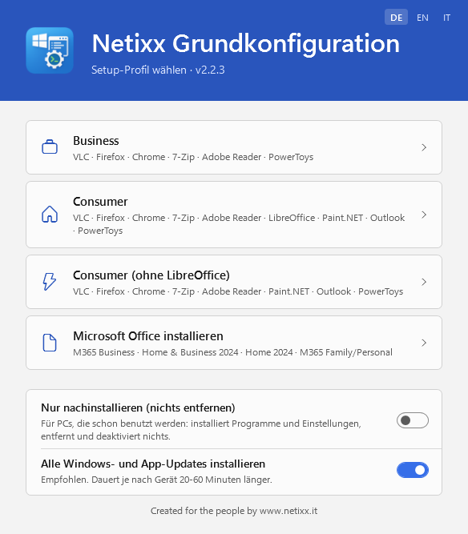
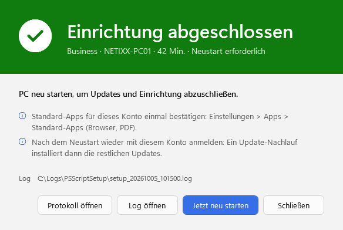
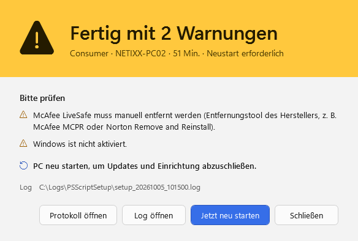
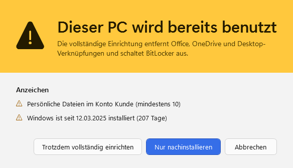
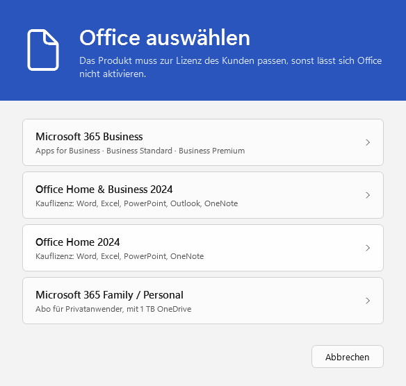
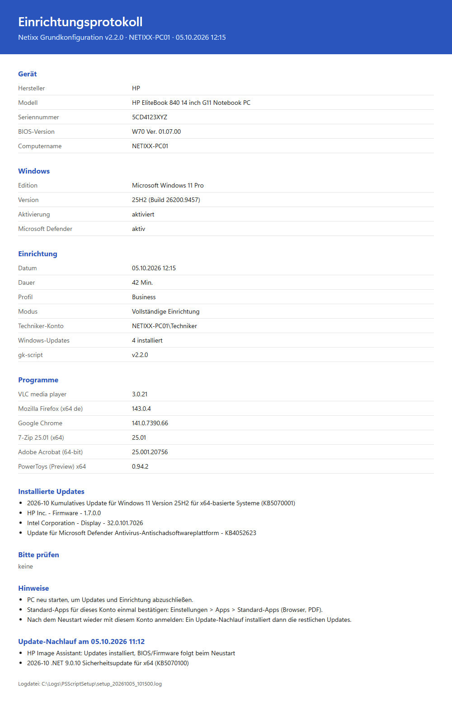

# gk-script

Windows 11 setup tool for Netixx IT Solutions. Automates the first-time setup of a customer PC — software, Windows updates and drivers, OEM branding, Windows settings, bloatware removal — across three profiles, plus an install-only mode for PCs already in use and a separate Microsoft Office installation. Ships as a self-contained `.exe` with a WPF menu.

## Requirements

- Windows 11
- Administrator privileges
- Internet connection (for package downloads)

## Deploy

Download the latest `gk-script.exe` from [Releases](https://github.com/gkscript/script/releases/latest) (direct link: <https://github.com/gkscript/script/releases/latest/download/gk-script.exe>), copy it to the target machine and double-click it. UAC elevation is handled automatically.

The menu opens in German. Switch to English or Italian with **DE · EN · IT** in the top-right corner; the result window follows that choice.

## Screenshots

| Menu | Done |
|---|---|
|  |  |
| **Finished with warnings** | **PC already in use** |
|  |  |
| **Office: pick the customer's licence** | **Handover report** |
|  |  |

Demo data. The windows follow the menu language (DE/EN/IT); `docs/screenshots/Make-Screenshots.ps1` renders them again after UI changes.

## Profiles

| | Profile | Packages |
|---|---|---|
| 💼 | Business | VLC · Firefox · Chrome · 7-Zip · Adobe Reader · PowerToys |
| 🏠 | Consumer | + LibreOffice · Paint.NET · Outlook (new, free) |
| ⚡ | Consumer (No LibreOffice) | + Paint.NET · Outlook (new, free) |

**Microsoft Office** is its own menu item: pick the product that matches the customer's licence (Microsoft 365 Business, Office Home & Business 2024, Office Home 2024, Microsoft 365 Family/Personal). The current installer is downloaded from Microsoft and installs silently in the Windows language with German/Italian proofing; any other Office is removed first. The customer signs in afterwards to activate.

Packages come from winget (vendor installers, hash-checked); Chocolatey is only a fallback and is removed afterwards.

All profiles include: all Windows updates (switchable in the menu), Office 365 uninstall, OEM branding, Netixx Helpdesk, bloatware/UWP removal (incl. Samsung Galaxy apps), OneDrive uninstalled, Windows suggestions/ads off, clean Start pins, Chrome and Firefox on the taskbar, daily Bing wallpaper, default apps for new accounts, cleanup and a restore point.

## Two modes

- **Full setup** (default) for a new PC: everything below.
- **Install only** (menu switch "Nur nachinstallieren", `-InstallOnly`) for a PC already in use: apps, Helpdesk, OEM info, Netixx settings, updates and the Bing wallpaper. Nothing is removed or turned off: no antivirus/Office/OneDrive removal, no debloat, no desktop cleanup, no BitLocker change, no Start pins, the recycle bin stays. Only the desktop shortcuts the installers just added go. A restore point is created first.
- A full run on a PC that looks used (an earlier run, personal files, Windows older than 30 days) asks first and offers install only.

## What it does (in order)

1. Pre-flight checks — admin, internet, time sync, disk space (5 GB), GPU, BitLocker
2. Remove preinstalled antivirus trials silently where possible; the rest is flagged for manual removal
3. Install packages with winget (Firefox in the Windows language; Chrome and PowerToys machine-wide), update the ones already there; Chocolatey only if winget fails
4. **Windows Update** (unless switched off in the menu): every available update — drivers (covers AMD), security/quality, optional and preview updates, feature upgrades, Defender definitions; then the NVIDIA App on NVIDIA GPUs
5. Registry and system settings: OEM branding, Windows suggestions/ads/Widgets/Recall/Edge ads off, Storage Sense, Fast Startup off, End task in the taskbar, Windows Terminal as default console, Defender blocks unwanted apps, sudo (new-window mode), notebook power settings on AC
6. Remove bloatware shortcuts, clean desktop shortcuts (whitelist-based; never on a OneDrive-redirected desktop)
7. Disable BitLocker if encrypted
8. Set up `C:\Install` (locked down), download the Netixx Helpdesk (signature-checked)
9. Uninstall Office 365 (Office Deployment Tool → winget → silent registry fallback)
10. Remove UWP bloat (Win11Debloat's default selection, OEM promo apps, Samsung Galaxy ecosystem apps; OEM update/hotkey/battery tools are kept) and Win32 promo software; uninstall OneDrive (also kept from installing in accounts created later); then update installed apps with winget
11. Prepare accounts created later (the customer's): Default profile settings, default apps via DISM; clean Start pins and Chrome/Firefox on the taskbar after the default pins (both applied once, instead of desktop icons); daily Bing wallpaper (4K) for every account
12. Health checks: activation, Defender, edition vs. profile
13. Clean up: update leftovers (DISM), Chocolatey, temp files, recycle bin; setup files removed at the next start; restore point
14. Restart Explorer, so the new settings show without signing out
15. Write the handover report (`C:\Install\Einrichtungsprotokoll.html`: device, serial number, Windows, apps with versions, updates, warnings) and, when a restart is pending, set up the update follow-up
16. Show the result window: green done / yellow warnings / red failed, warnings listed, Open report, restart button when needed, reminder to confirm default apps for the current account

After the restart, sign in with the same account: the **update follow-up** installs the updates that only appear after the restart (always after a feature update), updates apps and adds them to the report - up to three rounds.

The PC and display are kept awake for the whole run, so the result is on screen when you come back.

## Logs

Setup runs log to `C:\Logs\PSScriptSetup\setup_YYYYMMDD_HHmmss.log`; Office installs to `office_*.log` and the update follow-up to `update_*.log` in the same folder.

```powershell
# Open the latest log
Get-ChildItem C:\Logs\PSScriptSetup\ -Filter *.log |
    Sort-Object LastWriteTime -Descending |
    Select-Object -First 1 | ForEach-Object { notepad $_.FullName }
```

## Build

Requires `makensis.exe` (NSIS) installed.

```powershell
powershell -ExecutionPolicy Bypass -File build.ps1
```

Output: `gk-script.exe` in the repo root.

```powershell
# Static checks (also run by GitHub Actions on every push)
powershell -ExecutionPolicy Bypass -File tests\Test-Repository.ps1

# Release: version, changelog date, checks, build, commit, push, GitHub Release
powershell -ExecutionPolicy Bypass -File release.ps1 -Version 2.2.0 -Summary "short description"
```

## Run without building

```powershell
# Launch GUI (admin required)
launch.bat

# Run a profile directly
powershell -ExecutionPolicy Bypass -File src\main.ps1 -DeploymentType business
powershell -ExecutionPolicy Bypass -File src\main.ps1 -DeploymentType consumer
powershell -ExecutionPolicy Bypass -File src\main.ps1 -DeploymentType consumer-nolo

# Optional flags
-SkipUpdates            # No Windows Update and no app updates
-InstallOnly            # PC already in use: install and configure, remove nothing
-SkipBloatwareRemoval   # Skip the shortcut and desktop cleanup (debloat still runs)
-ConfigPath <path>      # Use alternate config.json
-Language de|en|it      # Window language (default: de)

# Install Microsoft Office (asks for the product unless -Product is given)
powershell -ExecutionPolicy Bypass -File src\office.ps1
powershell -ExecutionPolicy Bypass -File src\office.ps1 -Product m365business   # or homebusiness2024, home2024, m365home
```

## Project structure

```
gk-script.exe           ← self-contained deployment exe
launch.bat              → UAC elevation → PowerShell GUI
build.ps1               → builds gk-script.exe via NSIS
release.ps1             → one-command release (checks, build, commit, push, GitHub Release)
tests/Test-Repository.ps1 → static checks (PS 5.1 parsing, encodings, translations, config)
.github/workflows/ci.yml  → runs the checks and a test build on every push
src/
├── main.ps1            → setup run (profiles, full / install only): start-up and step sequence
├── steps/              → the step functions (packages, updates, settings, desktop, checks, report, ...)
├── postupdate.ps1      → update follow-up after the restart (copied to C:\Install\gk-script)
├── office.ps1          → Microsoft Office installation (own menu item)
├── config.json         → deployment profiles, package catalog (winget/Chocolatey IDs), paths
├── gui.csv             → WPF menu button definitions
├── debloat.ps1         → UWP + Win32 bloat removal, telemetry disable
├── BingWallpaper.ps1   → daily Bing wallpaper (copied to C:\Install, run per user by a task)
├── user_settings.reg / machine_settings.reg → Windows suggestions, policies, system settings
├── lang/               → UI texts (de, en, it)
├── lib/
│   ├── PSSetupUtility.psm1   → shared utilities (logging, pre-flight, result window)
│   ├── Office.ps1            → Office removal, current installer, install configuration
│   ├── Theme.xaml            → shared look of all windows
│   ├── WindowTheme.ps1       → theme loader, Mica, title-bar color
│   ├── Language.ps1          → UI language and text lookup
│   └── SetupResult.xaml      → end-of-run result window
└── PSScriptMenuGui/    → WPF CSV-driven menu module
```

## Customisation

- **Packages**: edit `src/config.json` — `packages` per profile; winget/Chocolatey IDs in `packageCatalog`
- **Bloat exclusions / OEM keep-list**: edit `$excluded` in `src/debloat.ps1`; extra removals in `$oemAndExtras` / `$win32Bloat`
- **Desktop icons to keep**: edit `src/whitelist.txt`
- **Taskbar pins**: `windows.taskbarPins` in `src/config.json` (Start-menu shortcut names)
- **Maker BIOS/firmware tool** (Dell, HP business): `"oemFirmware": true` per profile in `src/config.json` (default: business only)
- **Office products**: `office` in `src/config.json` — product IDs, OneDrive per product, excluded apps, proofing languages
- **OEM branding**: edit `src/Logo_Info.reg` (Windows 11 shows the support texts; it no longer displays an OEM logo)
- **Menu buttons**: edit `src/gui.csv` (`Icon` = Segoe Fluent Icons code, e.g. `E821`)
- **Window look**: edit `src/lib/Theme.xaml` (rules in `DESIGN.md`)
- **Texts / translations**: edit `src/lang/de.json`, `en.json`, `it.json` (same keys in all three)

## Changelog

### Unreleased
- MIT license, third-party notices for the menu module and Win11Debloat (shipped in the exe)

### v2.2.1 — 2026-10-05
- Screenshots in the README and on the release pages
- Report: "none" in the same size as the lists
- Menu footer: the slogan "Created for the people by www.netixx.it" stays English in every language, as before v1.3.0

### v2.2.0 — 2026-10-05
- Handover report `C:\Install\Einrichtungsprotokoll.html` (device, serial number, Windows, apps with versions, updates, warnings), opened from the result window
- Update follow-up: after the restart, signing in with the same account installs the updates that only appear then (up to three rounds) and adds them to the report
- The menu shows when a newer version is available on GitHub, with a download link
- Business profile on Dell and HP business models: BIOS, firmware and drivers from the maker's own tool (Dell Command Update, HP Image Assistant) in the update follow-up; the tool is removed afterwards
- Windows no longer turns device encryption back on by itself after BitLocker was switched off (full setup)
- Windows Update waits and retries while it is busy or the network isn't up yet
- Checks on every push (GitHub Actions, Windows PowerShell 5.1) and a one-command release script
- Repository history cleaned of old binaries (289 MB to 35 MB) - existing clones need a fresh clone
- `main.ps1` split into `src/steps/` (no behaviour change)

### v2.1.1 — 2026-10-05
- Cleanup: no desktop icon layout any more (the captured layout files were stale), so the end of the run no longer blanks the Winlogon shell - Explorer is simply restarted
- The bundled Office setup (7.4 MB) is gone: the current installer is always downloaded from Microsoft; the exe shrinks accordingly
- Removed unused code, config switches that did nothing (`logging.enabled`, `validation.requireAdmin`, ...) and the `-SkipHideConsole` parameter

### v2.1.0 — 2026-10-05
- Microsoft Office as its own menu item: Microsoft 365 Business, Home & Business 2024, Home 2024 or Microsoft 365 Family/Personal, with the current installer from Microsoft, German/Italian proofing, classic and new Outlook
- Chrome and Firefox are pinned to the taskbar (after the default pins, once) instead of sitting on the desktop
- Consumer profiles install and update the free new Outlook instead of removing it
- Apps that are already installed are updated during the run
- Install-only mode for PCs already in use (menu switch / `-InstallOnly`): installs and configures, removes nothing
- A full run on a PC that looks used asks first: install only, full setup anyway, or cancel
- The daily Bing wallpaper no longer replaces a picture the user chose, a slideshow or a solid color

### v2.0.1 — 2026-10-05
- Fixed: the exe ran the whole setup in 32-bit PowerShell (the NSIS stub is 32-bit). OEM support info and other `HKLM\SOFTWARE` writes landed in `WOW6432Node`, 64-bit programs were invisible to the antivirus/Office/promo-software removal, and Explorer's Winlogon switch hit the wrong key. `launch.bat` now starts the 64-bit PowerShell, and `main.ps1` restarts itself in 64-bit if started from a 32-bit process.
- Fixed: re-applying the OEM branding reported a bogus warning on every run ("Der Vorgang wurde erfolgreich beendet.")
- OneDrive is uninstalled silently, and accounts created later no longer install it at first sign-in

### v2.0.0 — 2026-10-04
- Safety: Explorer's Winlogon Shell value is always restored (finally); desktop cleanup removes only shortcuts, never on a OneDrive-redirected desktop, and now also cleans the Public Desktop; `C:\Install` is no longer writable by all users
- Debloat follows Win11Debloat's default selection (live list now actually loads on PowerShell 5.1); OEM tools for BIOS/driver updates, Fn keys and battery care are kept; the "office" uninstall that could hit OneDrive is gone
- New user accounts (the customer's own) get the same settings via the Default profile, and default apps via DISM
- Windows suggestions/ads, auto-installed suggested apps, Widgets, Recall/Click to Do and Edge ads turned off
- Preinstalled antivirus trials removed silently where possible, otherwise flagged; final checks for activation, Defender and edition; any pending reboot is offered
- Windows Update installs everything available, not only drivers: security/quality, optional and preview updates, feature upgrades, Defender definitions; installed apps are updated with winget (registered when missing); menu switch to run without updates (`-SkipUpdates`)
- Packages from winget (Firefox DE/IT, Chrome without checksum bypass, Adobe with auto-update, current LibreOffice); Chocolatey only as fallback and removed afterwards; PowerToys on every profile; NVIDIA App on every NVIDIA GPU; Intel step removed (package did not exist)
- Samsung Galaxy Book: ecosystem and promo apps removed, Samsung Settings / Device Care / Update / Recovery kept
- Default apps: SetUserFTA removed (blocked on Windows 11 Home/Pro, non-commercial licence) - new accounts get them via DISM, the result window reminds the technician for the current account
- Clean Start menu pins (applied once), daily Bing wallpaper in 4K for every account, End task in the taskbar, Windows Terminal as default, sudo enabled, Storage Sense, Fast Startup off, Defender blocks unwanted apps, notebook power settings
- Cleanup at the end (update leftovers, temp files, recycle bin, setup files at next start) and a restore point
- Win32 promo software removed silently by registry match (language-independent); AutoHotkey Chrome web-app step and the unused OEM logo removed

### v1.3.0 — 2026-10-04
- Multilingual UI: German (default), English, Italian, switchable in the menu (DE · EN · IT); menu, result window and the listed warnings are translated, the log stays English
- The failure window names the step that stopped, and pre-flight failures get a plain-language reason
- Fixed: warnings could collapse into one "System.String[]" line in the failure window

### v1.2.0 — 2026-10-04
- New result window replaces all message boxes: green / yellow / red status band (also in title bar and taskbar), warnings listed, Open log, Restart now when drivers need it
- Menu redesigned on the same Windows 11 window system (Mica, settings-card rows, Fluent icons); one shared theme for all windows
- Windows Update driver install on every machine (covers AMD, which has no package source)
- Office removal: silent Office Deployment Tool restored as first pass; never opens the interactive uninstall wizard
- PC and display kept awake during the run
- Helpdesk download is signature-checked (TeamViewer) before it lands on the desktop
- Fixed: every message box crashed on PowerShell 5.1 (WinForms not loaded), which also turned successful runs into "Setup failed"
- Fixed: native-command errors aborting the whole run; killed installers counted as success; NVIDIA App skipped when any NVIDIA component existed; debloat stopping at the first non-removable app; unsafe Win11Debloat removals; empty log path in messages

### v1.1.2 — 2026-05-07
- Removed redundant GUI header; title bar shows version
- Emoji-differentiated deployment buttons (💼 🏠 ⚡)
- Added Lenovo Smart Meeting to bloat removal list
- Kept Clipchamp from removal
- Fixed `disable_telemetry.reg` encoding (UTF-16 LE — required by reg.exe)
- Fixed OEM branding re-apply crash after debloat

### v1.1.1 — 2026-05-07
- Fixed debloat.ps1 parse error caused by em dash encoding in PS5
- Live Win11Debloat list fetch with offline fallback
- OEM branding re-applied after debloat step

### v1.1.0
- consumer-nolo profile (consumer without LibreOffice)
- Animated WPF button hover effects
- Gradient button styling

### v1.0.0
- Initial release

## License

[MIT](LICENSE) - Copyright (c) 2023-2026 Netixx GmbH / Srl (Netixx IT Solutions). Provided "as is", without warranty of any kind: the tool uninstalls software and turns off BitLocker - test it before you use it.

Not covered by the license: the Netixx name, logo and icon (`src/netixx.ico`), the Netixx Helpdesk configuration and the Netixx contact details in `src/Logo_Info.reg`. Don't use them to brand a derived tool.

Third-party code (menu module, Win11Debloat app list and registry values) is MIT-licensed as well; see [src/THIRD-PARTY-NOTICES.txt](src/THIRD-PARTY-NOTICES.txt).
